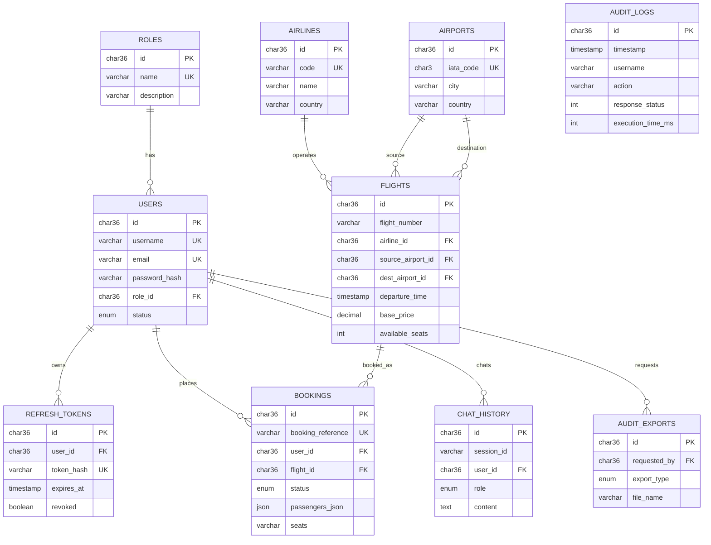

# SkyBook AI — Database Design

> **Lab only.** Schema and seed data support a security research / training environment.  
> Default passwords in `seed.sql` must never be used outside an isolated lab.

## 1. Overview

| Item | Value |
|------|-------|
| DBMS | MySQL 8.x |
| Database name | `skybook` |
| Charset | `utf8mb4` / `utf8mb4_unicode_ci` |
| Schema | [`database/schema.sql`](../database/schema.sql) |
| Seed | [`database/seed.sql`](../database/seed.sql) |
| Init helper | [`database/init.sh`](../database/init.sh) |

## 2. Tables

| Table | Purpose |
|-------|---------|
| `roles` | `CUSTOMER`, `ADMIN` |
| `users` | Account profiles + password hash |
| `refresh_tokens` | Rotatable refresh tokens (hashed) |
| `airlines` | Carrier catalog |
| `airports` | Airport catalog (IATA) |
| `flights` | Schedules, price, seat inventory |
| `bookings` | Ticket purchases + passengers JSON |
| `audit_logs` | Security / action audit trail |
| `chat_history` | AI conversation turns |
| `audit_exports` | Admin export history metadata |

> Named tables from requirements map as: Users→`users`, Flights→`flights`, Bookings→`bookings`, AuditLogs→`audit_logs`, ChatHistory→`chat_history`, Airlines→`airlines`, Airports→`airports`, Roles→`roles`, RefreshTokens→`refresh_tokens`.

## 3. Entity Relationship Diagram



## 4. Audit log columns (required fields)

| Column | Maps to requirement |
|--------|---------------------|
| `id` | Audit ID |
| `timestamp` | Timestamp |
| `username` | Username |
| `user_id` | User ID |
| `role` | Role |
| `ip_address` | IP Address |
| `session_id` | Session ID |
| `action` | Action |
| `resource` | Resource |
| `http_method` | HTTP Method |
| `response_status` | Response Status |
| `browser` | Browser |
| `operating_system` | Operating System |
| `execution_time_ms` | Execution Time |
| `details` | Extra JSON context |

**Canonical actions:** `USER_LOGIN`, `USER_LOGOUT`, `BOOKING_CREATED`, `BOOKING_CANCELLED`, `AI_QUERY`, `PROFILE_UPDATE`, `PASSWORD_CHANGE`, `EXPORT_REQUEST`.

## 5. Seed summary

| Entity | Count (approx.) |
|--------|-----------------|
| Roles | 2 |
| Users | 5 (1 admin, 4 customers) |
| Airlines | 8 |
| Airports | 15 |
| Flights | 20 (relative future dates) |
| Bookings | 5 (incl. 1 cancelled) |
| Audit logs | 12 |
| Chat turns | 6 |
| Audit exports | 3 |

### Lab credentials

| Username | Password | Role |
|----------|----------|------|
| `admin` | `Admin@123` | ADMIN |
| `jdoe` | `Customer@123` | CUSTOMER |
| `asmith` | `Customer@123` | CUSTOMER |
| `mchen` | `Customer@123` | CUSTOMER |
| `lwong` | `Customer@123` | CUSTOMER |

Passwords are BCrypt-hashed in `seed.sql`.

## 6. Indexes & integrity highlights

- Flight search: `(source_airport_id, dest_airport_id, departure_time)`, `base_price`, `airline_id`
- Booking uniqueness: `booking_reference`
- Audit filters: `timestamp`, `username`, `action`
- Seat inventory: `CHECK (available_seats >= 0 AND available_seats <= total_seats)`
- Optimistic locking: `flights.version`

## 7. Apply manually

```bash
mysql -u root -p < database/schema.sql
mysql -u root -p < database/seed.sql
```

Or use Docker (Phase 6) — Compose will mount these into MySQL init.

## 8. Phase status

**Phase 2 — Database: confirmed.** Schema/seed remain source of truth; see also Phase 7 docs index.
