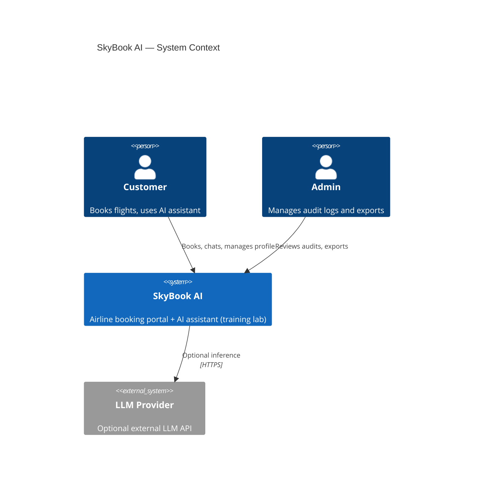
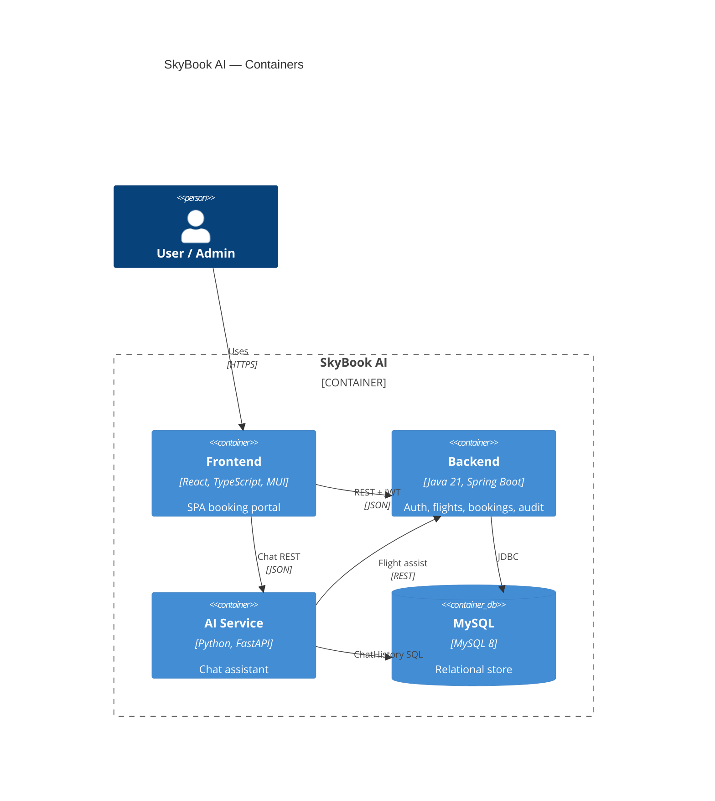
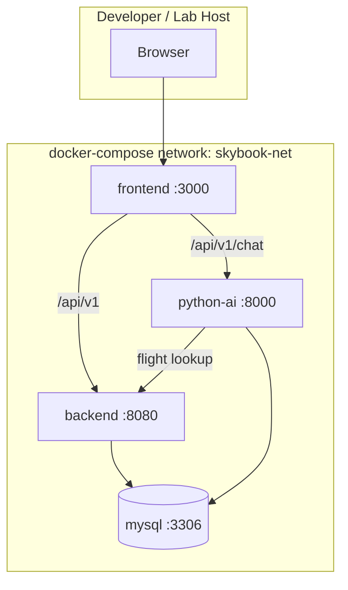
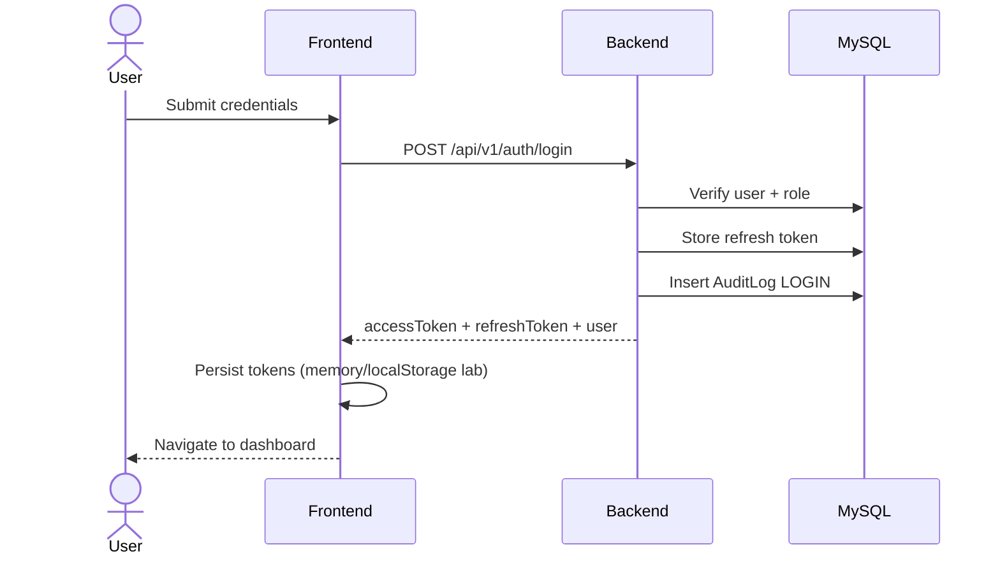
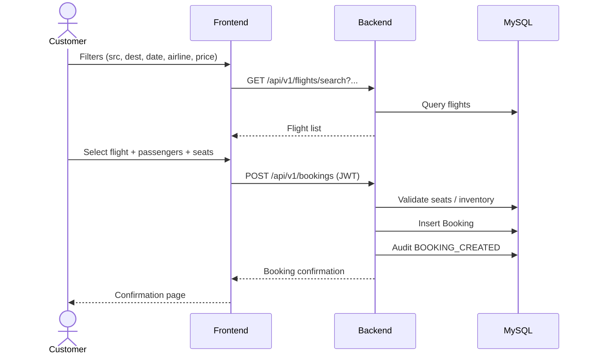
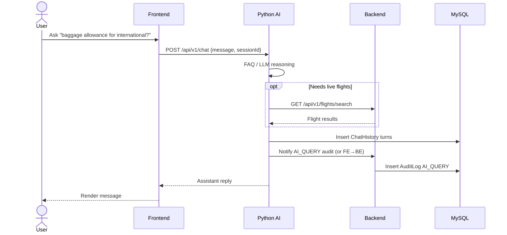
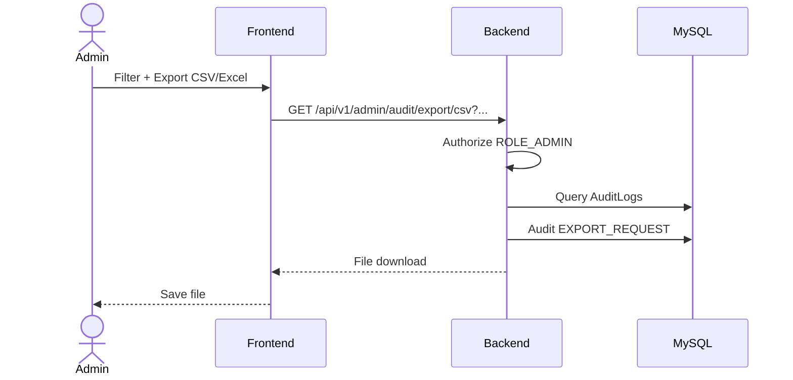
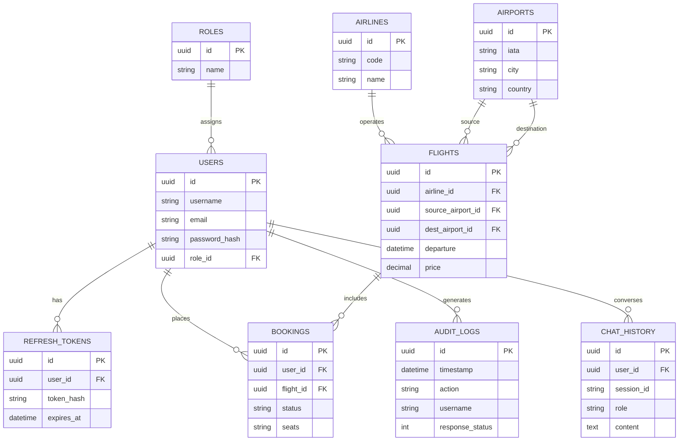
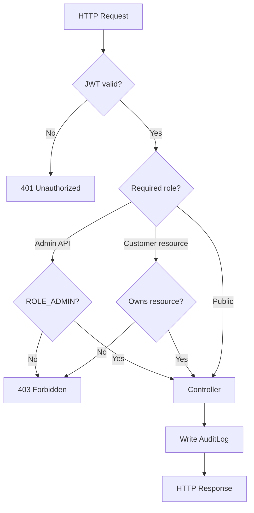
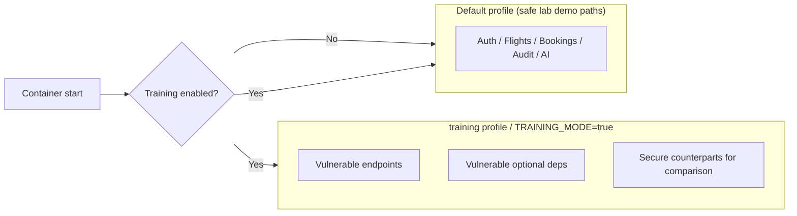

# SkyBook AI — Architecture Diagrams

> Source Mermaid diagrams for Phase 1. Render in any Mermaid-compatible viewer (GitHub, VS Code, docs site).

---

## 1. System Context (C4 L1)

---

## 2. Container Diagram (C4 L2)

---

## 3. Deployment (Docker Compose)

---

## 4. Sequence — Login

---

## 5. Sequence — Search & Book Flight

---

## 6. Sequence — AI Chat Query

---

## 7. Sequence — Audit Export (Admin)

---

## 8. Domain ER (Logical) — Preview for Phase 2

---

## 9. AuthZ Decision Flow

---

## 10. Training Mode Isolation

